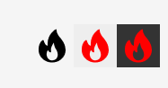

# Gray-Part Pitfalls — Battle-Tested Fixes

Mistakes that bit during real builds of gray-flow Flutter apps on Android
(June 2026). Each section lists the symptom, the root cause, and the
exact fix. Apply these proactively when scaffolding a new gray-part
project; do not wait for the error to appear.

---

## 1. `file_picker >= 10.x` breaks `GeneratedPluginRegistrant`

### Symptom

```
GeneratedPluginRegistrant.java:34: error: cannot find symbol
  flutterEngine.getPlugins().add(new com.mr.flutter.plugin.filepicker.FilePickerPlugin());
                                                                     ^
  symbol:   class FilePickerPlugin
  location: package com.mr.flutter.plugin.filepicker
```

Followed by a Flutter warning like:

> Your app uses the following plugins that apply Kotlin Gradle Plugin (KGP):
> appsflyer\_sdk, device\_info\_plus, file\_picker, package\_info\_plus

### Cause

Starting with `file_picker 10.x`, the Android plugin is **Kotlin-only**
(`FilePickerPlugin.kt`) and ships with its own Kotlin Gradle Plugin
declaration. That KGP clashes with Flutter's Built-in Kotlin support, so
the Kotlin compile step for `:file_picker` is skipped and the Java
`GeneratedPluginRegistrant` finds no class to register.

### Fix

Pin `file_picker` to the last Java-based release:

```yaml
# pubspec.yaml
dependencies:
  # NOTE: do NOT upgrade. 10+ is Kotlin-only and brings its own KGP that
  # collides with Flutter's Built-in Kotlin support.
  file_picker: 8.1.4
```

Then:

```powershell
cd android ; .\gradlew.bat --stop ; cd ..
flutter clean
flutter pub get
# delete the stale registrant — it will regenerate on next build
Remove-Item android\app\src\main\java\io\flutter\plugins\GeneratedPluginRegistrant.java -ErrorAction SilentlyContinue
```

Always call `FilePicker.platform.pickFiles(...)` (instance) rather than
the deprecated static `FilePicker.pickFiles(...)`. Works on every
version 5.x – 8.x.

---

## 2. Plugin compiled against older Android SDK than its transitive deps

### Symptom

```
> Dependency ':flutter_plugin_android_lifecycle' requires libraries and
  applications that depend on it to compile against version 36 or later
  of the Android APIs.
  :file_picker is currently compiled against android-34.
  Recommended action: Update this project to use a newer compileSdk
  of at least 36, for example 36.
```

### Cause

Older plugin releases hard-code `compileSdk = 34` (or 33). Their
transitive dependencies (e.g. `flutter_plugin_android_lifecycle`) bump
to `36`. Gradle's `CheckAarMetadata` then aborts.

### Fix

Override `compileSdk` for every Android library subproject from the
**root** `android/build.gradle.kts`. The override MUST be registered
**before** the `evaluationDependsOn(":app")` block, otherwise Gradle
throws `Cannot run Project.afterEvaluate(Action) when the project is
already evaluated`.

```kotlin
// android/build.gradle.kts
subprojects {
    val newSubprojectBuildDir: Directory = newBuildDir.dir(project.name)
    project.layout.buildDirectory.value(newSubprojectBuildDir)

    // -----------------------------------------------------------------
    // Force every Android library plugin to compile against the same
    // compileSdk our app uses (36+). Some plugins ship with compileSdk=34
    // but their transitive deps require 36.
    //
    // Registered BEFORE evaluationDependsOn(":app") below — otherwise
    // the target projects will already be evaluated and Gradle refuses
    // to attach an afterEvaluate callback.
    // -----------------------------------------------------------------
    afterEvaluate {
        extensions
            .findByType(com.android.build.gradle.LibraryExtension::class.java)
            ?.apply {
                if ((compileSdk ?: 0) < 36) {
                    compileSdk = 36
                }
            }
    }
}

subprojects {
    project.evaluationDependsOn(":app")
}
```

---

## 3. VPN makes the No-Internet screen flash on a healthy connection

### Symptoms

* Switching VPN on/off briefly shows the No-Internet screen even though
  the network is up.
* With VPN **on**, the No-Internet screen never disappears even when
  internet works fine (e.g. browser loads pages).
* Pre-screen flicker shows the WebView's native error page (black canvas
  with the Android-robot icon) for a couple of seconds before the
  styled No-Internet screen.

### Causes

| # | Symptom | Cause |
|---|---------|-------|
| A | None-flash | `connectivity_plus` emits `[ConnectivityResult.none]` for a few hundred ms while the VPN interface is being brought up. |
| B | Stuck on No-Internet w/ VPN | DNS resolution latency through the VPN tunnel exceeds the 3-second probe timeout → `TimeoutException` → false negative. |
| C | Black robot screen | WebView's native error page renders for any `onWebResourceError`, and the redundant DNS re-probe inside `_gotoOfflineIfDown()` keeps it visible up to 7 s. |

### Fixes

**A. Whitelist VPN as a real interface + treat `bluetooth` / `other` too:**

```dart
// core/net_sensor.dart
const _activeResults = {
  ConnectivityResult.wifi,
  ConnectivityResult.mobile,
  ConnectivityResult.ethernet,
  ConnectivityResult.vpn,           // ★ VPN IS connectivity
  ConnectivityResult.bluetooth,
  ConnectivityResult.other,
};

Future<bool> isOnline() async {
  final results = await _plugin.checkConnectivity();
  if (!results.any(_activeResults.contains)) return false;
  // …
}
```

**B. Raise DNS probe timeout 3 s → 7 s.** Real "no internet" cases throw
`SocketException` instantly (no route), so the larger timeout is free.

```dart
final answer = await InternetAddress.lookup(host)
    .timeout(const Duration(seconds: 7));
```

**C. Debounce the connectivity stream in `ContentScreen` / `PortalStage`.**
700 ms is invisible to the user and absorbs every observed flicker.

```dart
Timer? _offlineDebounce;

_connSub = widget.netSensor.statusStream.listen((statuses) {
  final allNone = statuses.every((s) => s == ConnectivityResult.none);
  if (!allNone) {
    _offlineDebounce?.cancel();
    return;
  }
  _offlineDebounce?.cancel();
  _offlineDebounce = Timer(const Duration(milliseconds: 700), () {
    _gotoOfflineDirect();
  });
});
```

Don't forget `_offlineDebounce?.cancel()` in `dispose()`.

---

## 4. `ERR_NAME_NOT_RESOLVED` shows the native WebView error page first

### Symptom

When DNS fails inside the WebView (VPN throttling, captive portal, ISP
filter), the user sees a black screen with the small Android-robot icon
in the top-left and tiny grey error text for **2 – 7 seconds** before
the styled No-Internet screen appears.

### Cause

`onWebResourceError` was calling `_gotoOfflineIfDown()`, which itself
does another DNS lookup (up to 7 s). During those seconds Android draws
its built-in error page on top of our otherwise empty WebView.

### Fix

In `onWebResourceError`:

1. **Immediately** flip `_isLoading = true` (or `_spinning = true`) — this
   covers the WebView with a styled spinner overlay so the native error
   page is never visible.
2. **Skip the redundant DNS probe** for the well-known DNS / disconnect
   error codes — just go to the No-Internet screen directly.

```dart
onWebResourceError: (err) {
  if (err.isForMainFrame != true) return;
  final blurb = err.description.toLowerCase();

  // (existing) redirect-loop retry first
  // …

  // Cover the WebView's native error page IMMEDIATELY.
  if (mounted) setState(() => _isLoading = true);

  final isDnsOrDisconnect =
      blurb.contains('name_not_resolved') ||
      blurb.contains('err_name_not_resolved') ||
      blurb.contains('internet_disconnected') ||
      blurb.contains('network_changed') ||
      err.errorCode == -105 || // ERR_NAME_NOT_RESOLVED
      err.errorCode == -106 || // ERR_INTERNET_DISCONNECTED
      err.errorCode == -21;    // ERR_NETWORK_CHANGED

  if (isDnsOrDisconnect) {
    _gotoOfflineDirect();      // skip redundant DNS probe
  } else {
    _gotoOfflineIfDown();
  }
},
```

---

## 5. `flutter_local_notifications 18.x` requires core-library desugaring

### Symptom

```
> Could not resolve all files for configuration ':app:debugRuntimeClasspath'.
  Cannot find a version of 'com.android.tools:desugar_jdk_libs' …
```

or runtime crash because `java.time.*` is unavailable on API 24-25.

### Fix

In `android/app/build.gradle.kts`:

```kotlin
android {
    compileOptions {
        isCoreLibraryDesugaringEnabled = true
        sourceCompatibility = JavaVersion.VERSION_17
        targetCompatibility = JavaVersion.VERSION_17
    }
}

dependencies {
    coreLibraryDesugaring("com.android.tools:desugar_jdk_libs:2.1.4")
}
```

---

## 6. Kotlin incremental compilation cache fails when project path has spaces

### Symptom

```
> Could not close incremental caches in
  C:\…\My Projects\foo\android\…
```

### Fix

```properties
# android/gradle.properties
kotlin.incremental=false
```

(Trivial loss in incremental build time; required on Windows whenever
the project path contains a space, slash, non-ASCII character, etc.)

---

## 7. `Project.afterEvaluate(Action)` cannot run when project is already evaluated

### Symptom

```
* Where: Build file 'android/build.gradle.kts' line: 29
* What went wrong:
  Cannot run Project.afterEvaluate(Action) when the project is already evaluated.
```

### Cause

`subprojects { project.evaluationDependsOn(":app") }` triggers eager
evaluation of every subproject. Any **subsequent** `subprojects {
afterEvaluate { … } }` block then arrives too late.

### Fix

Always declare `afterEvaluate` overrides in the same `subprojects` block
that sets `layout.buildDirectory`, **before** the
`evaluationDependsOn(":app")` block.

See section 2 for the full pattern.

---

## 8. Release `versionCode` / `versionName` must be bumped per build

### Symptom

Play Store upload rejected: "You need to use a different version code
for your APK because you already have one with version code 1."

### Fix

Bump version in **two** places, in sync:

```yaml
# pubspec.yaml
version: 1.0.1+2     #  ↑ versionName  ↑ versionCode
```

```kotlin
// android/app/build.gradle.kts
defaultConfig {
    versionCode = 2
    versionName = "1.0.1"
}
```

`flutter` honours `pubspec.yaml` automatically only if `build.gradle.kts`
uses `versionCode = flutter.versionCode` / `versionName = flutter.versionName`.
If those are hard-coded (as in this template), edit both.

---

## 9. Stale `GeneratedPluginRegistrant.java` survives plugin changes

### Symptom

After switching plugin versions, build fails with
`cannot find symbol: SomePlugin` even though the plugin source file
exists in `~/.pub-cache`.

### Fix

The registrant is regenerated by `flutter pub get`, but it is **never
overwritten** if it already exists. Delete it manually and re-run
`flutter pub get` (or just `flutter build`):

```powershell
Remove-Item android\app\src\main\java\io\flutter\plugins\GeneratedPluginRegistrant.java
flutter pub get
```

Pair this with `gradlew --stop` on Windows.

---

## 10. Quick-recovery cookbook (Windows / paths with spaces)

When the Android side misbehaves and you've changed plugin versions:

```powershell
cd android
.\gradlew.bat --stop
cd ..
flutter clean
Remove-Item android\app\src\main\java\io\flutter\plugins\GeneratedPluginRegistrant.java -ErrorAction SilentlyContinue
flutter pub get
flutter build apk --debug          # smoke-test compile
flutter build apk --release --obfuscate --split-debug-info=build/debug_info
flutter build appbundle --release --obfuscate --split-debug-info=build/debug_info
```

---

## 11. 16 KB page-size support (Android 15+ / Flutter + Kotlin)

### Symptom

App crashes on start on Android 15 devices with a 16 KB page size
kernel, or the Play Store submission is rejected with:

> Your app targets Android 15+ but is not compatible with 16 KB
> page sizes. From November 1, 2025, all apps targeting Android 15+
> must support this.

### Cause

Flutter's engine + all native `.so` libraries must be built with
`-Wl,-z,max-page-size=16384` so their ELF segments align on 16 KB
boundaries. Older Flutter / Kotlin / Gradle plugin combinations still
emit 4 KB-aligned binaries and fail on the new devices.

### Fix

1. **Flutter channel** — upgrade to a Flutter that ships with the
   16 KB-aligned engine (Flutter 3.29+ on stable). Verify:

   ```powershell
   flutter --version
   # Flutter 3.29.0 or newer required
   ```

2. **Android Gradle Plugin** — bump to `8.5.2` or newer in
   `android/settings.gradle.kts`:

   ```kotlin
   plugins {
       id("com.android.application") version "8.5.2" apply false
       id("org.jetbrains.kotlin.android") version "1.9.24" apply false
       id("dev.flutter.flutter-plugin-loader") version "1.0.0"
   }
   ```

3. **NDK version** — `ndkVersion = "27.0.12077973"` (or newer) in
   `android/app/build.gradle.kts`. The default `flutter.ndkVersion`
   only satisfies this on recent Flutter channels; pin explicitly if
   your channel is older.

4. **Native plugin audit.** Any dependency that ships prebuilt `.so`
   files must publish 16 KB-aligned versions. As of 2026 the ones
   used by this template are all fine:

   - `webview_flutter_android` (uses system WebView, no `.so`)
   - `appsflyer_sdk >= 6.16.0`
   - `firebase_messaging >= 15.2.0`
   - `flutter_secure_storage >= 10.0.0`
   - `flutter_local_notifications >= 18.0.0`

   If you introduce a plugin with an older native binary, verify with:

   ```powershell
   apkanalyzer files list build\app\outputs\apk\release\*.apk `
     | Select-String '\.so'
   # then for each .so:
   readelf -l <path/to.so> | Select-String LOAD
   # look for `Align 4000` (4 KB) vs `Align 4000` (WRONG) — must be `4000` (16 KB)
   ```

5. **Gradle properties.** Add / verify:

   ```properties
   # android/gradle.properties
   android.useAndroidX=true
   android.enableJetifier=true
   android.experimental.enableNewResourceShrinker=true
   ```

6. **Full clean rebuild.** After bumping any of the above:

   ```powershell
   cd android ; .\gradlew.bat --stop ; cd ..
   flutter clean
   flutter pub get
   Remove-Item android\app\src\main\java\io\flutter\plugins\GeneratedPluginRegistrant.java -ErrorAction SilentlyContinue
   flutter build apk --release --obfuscate --split-debug-info=build\debug_info
   ```

7. **Verification on a real device / emulator.**

   ```powershell
   # From an Android 15 emulator with 16 KB pages enabled:
   adb shell getconf PAGE_SIZE
   # Must print 16384
   adb install build\app\outputs\apk\release\app-release.apk
   adb shell am start -n <package>/<activity>
   # App must open without SIGSEGV or "cannot map segment" errors.
   ```

---

## 12. Push-permission "Skip" button barely visible

### Symptom

On the notification-permission screen the small "Skip" text link
disappears against the background artwork on some devices (dark hero
image + white 85 %-opacity text = 1.5:1 contrast, fails WCAG). QA
misses it entirely, users perceive there is no way to decline, then
press Accept and hit deny in the system dialog — burning the one
allowed permission prompt.

### Fix

Skip must render as a **real gradient button**, not a subdued text
link. Use the same gold / brand gradient as the Accept button (or a
muted variant of it), matching the Accept button's radius / height /
margin. The visual weight of Accept > Skip must come from **size and
position**, never from opacity.

Concrete rules:

- Skip button height ≥ 44 dp (Google minimum tap target).
- Same corner radius as Accept (usually `BorderRadius.circular(50)`
  or `16`).
- Same gradient family — either the identical gold, or a slightly
  darker variant with ≥ 4.5:1 contrast against the background.
- Position: directly below Accept, gap 12–18 dp, both centered
  horizontally within the same padding rail.
- No `opacity: 0.85` global multiplier — kill that pattern.

If the client insists on a "text-link Skip", require a solid
translucent pill behind the label:

```dart
Container(
  padding: EdgeInsets.symmetric(horizontal: 22, vertical: 12),
  decoration: BoxDecoration(
    color: Colors.black.withValues(alpha: 0.55),
    borderRadius: BorderRadius.circular(24),
    border: Border.all(color: Colors.white.withValues(alpha: 0.6)),
  ),
  child: Text('Skip', style: ...),
)
```

---

## 13. Button label baseline drift (labels look tilted / off-center)

### Symptom

The label inside a `PrimaryButton` sits visually higher or lower than
the geometric center of the pill, or looks off-axis relative to the
icon next to it. Especially visible on the loading screen "Retry",
the push-permission "Accept / Skip", and the game menu buttons.

### Cause

Most bespoke button widgets stack `Row(children:[Icon, Text])` inside
a `Container` without an explicit vertical baseline align. When the
font has different top / bottom bearings than the icon glyph, the
row appears tilted.

### Fix (mandatory pattern for every button in the shell)

Wrap the label in a `Baseline`-aware container and pin cross-axis
alignment to `CrossAxisAlignment.center`. Then override the text's
`height` line-height to 1.0 to remove font-provided top padding:

```dart
Row(
  mainAxisAlignment: MainAxisAlignment.center,
  crossAxisAlignment: CrossAxisAlignment.center, // hard-set
  children: [
    if (icon != null) ...[
      Icon(icon, size: 22),
      const SizedBox(width: 8),
    ],
    Text(
      label,
      textAlign: TextAlign.center,
      style: TextStyle(
        fontSize: 18,
        fontWeight: FontWeight.w700,
        height: 1.0,          // ← removes baseline drift
        letterSpacing: 0.3,
      ),
    ),
  ],
)
```

If a design calls for an off-center label (e.g. `labelDx: -5` used in
some existing widgets), verify visually in BOTH orientations — the
offset that looks centered in portrait often looks tilted in landscape
because the button width changes.

---

## 14. Landscape safe zone missed on camera / notch (~50 % of builds)

### Symptom

Rotated to landscape on a device with a punch-hole camera or notch
on the LONG edge, the WebView content (or a screen background) is
drawn UNDER the cutout — content clipped, buttons unreachable.
Portrait works fine because the notch is on the short edge and
`SafeArea` picks it up "for free".

### Cause

`SafeArea(bottom: false, child: WebViewWidget(...))` handles top +
sides on the DEFAULT case, but many implementations only apply
padding for `Orientation.portrait`. Any of these patterns is wrong:

```dart
// ❌ Only pads on portrait — landscape cutout is ignored
padding: orientation == Orientation.portrait
    ? EdgeInsets.only(top: viewPadding.top)
    : EdgeInsets.zero,

// ❌ Uses viewInsets (keyboard) instead of viewPadding (cutout)
padding: MediaQuery.viewInsetsOf(context),
```

### Fix

Always apply `viewPadding` on BOTH axes, gated only on orientation
for the TOP / SIDES distinction:

```dart
final MediaQueryData mq = MediaQuery.of(context);
final Orientation o = mq.orientation;
final EdgeInsets safe = o == Orientation.landscape
    ? EdgeInsets.only(
        left: mq.viewPadding.left,
        right: mq.viewPadding.right,
        top: mq.viewPadding.top,       // some rotate the notch top-side
      )
    : EdgeInsets.only(top: mq.viewPadding.top);
```

Alternatively, use `SafeArea(bottom: false, child: ...)` which handles
all four cases correctly — but only if you have NOT called
`SystemChrome.setEnabledSystemUIMode(SystemUiMode.immersiveSticky)`
in the same subtree without a matching `SafeArea`.

**QA test:** on a Pixel 6+ / Samsung S23+ / any punch-hole device,
rotate to landscape on:

- Loading screen
- Push-invite screen
- No-Wi-Fi screen
- WebView content screen

Verify the cutout has a black gutter next to it. This must be in
FINAL_CHECKLIST Part C §12.

---

## 15. Notification icon must be a flame — not necessarily monochrome

### Symptom

Reviewers / users perceive the app as "generic" or "spammy" because
the small notification icon is a bell / dot / question mark placeholder.
Alternatively the icon IS a flame but you drew it as a plain silhouette
and it disappears against Android's automatic tint on some launchers.

### Cause

Android accepts any `<vector>` drawable as `ic_notification`, but the
gray-flow contract with our partners requires the icon to be a
**flame / fire shape** — this is the visual identity of the ecosystem
and users recognize it. It does NOT have to be white / monochrome; a
duotone red-and-black flame is allowed as long as the shape reads as
fire at 24 × 24 dp.

Reference silhouettes (any of these is acceptable):



Bells, stars, generic app-logo miniatures, dot-with-exclamation → all
reject.

### Fix

`android/app/src/main/res/drawable/ic_notification.xml` must:

- Be a `<vector>` with a flame/fire `pathData` — not a raster.
- Read as fire from ~ 24 × 24 dp (test in Android Studio's preview).
- Have a silhouette clearly different from the launcher icon (a
  reviewer must not confuse the two).
- Colour freedom: solid white, solid black, or a two-tone red/orange
  fill (`android:fillColor="#E11919"` etc.) are all fine.

Do NOT ship the following as `ic_notification`:

- The launcher icon shrunk down.
- A monochrome version of the launcher icon.
- Any shape that isn't recognisably fire.

If you're generating from scratch and don't have the artwork, use the
canonical flame path documented in `.cursor/rules/custom_screens.md`
§"Notification Icon".

---

## 16. Launcher icon crops / upscales / has white borders on splash

### Symptom (multiple related issues — happens ~70 % of the time)

- Adaptive icon: the artwork zooms in and 60–90 % of the design is
  hidden behind the mask (`AdaptiveIconDrawable` safe zone is 66 dp
  of a 108 dp canvas, foreground must fit inside that).
- Launcher preview looks like a giant coloured blob instead of a
  legible icon.
- On app start, a white rectangular frame flashes around the icon
  before the loading screen — comes from `LaunchTheme` using the
  legacy `@mipmap/ic_launcher` with a solid-colour windowBackground.
- Rendering artifacts / soft edges from over-upscaling a small
  source PNG.

### Fix — three separate parts, all mandatory

**A. Foreground artwork must sit inside the 66 % safe zone.**

The `flutter_launcher_icons` `adaptive_icon_foreground` file should
have its important content in the CENTER 66 % of the canvas. This
means:

- Source PNG resolution ≥ 1024 × 1024.
- Actual design occupies the middle 675 × 675 area of that 1024 × 1024
  canvas, with transparent margin around it.
- If the current design fills edge-to-edge and the launcher upscales
  it, **shrink the foreground artwork in a graphics editor first** —
  do not rely on the mask to "just crop it".

Quick test:

- Open `assets/generated/app_icon_foreground.png` in an editor.
- Draw a circle of diameter = 66 % of the canvas dimension.
- Every important pixel (letters, character head, logo shape) must
  fit inside that circle.

**B. Background can be a solid colour OR an image, but must be full-bleed.**

`adaptive_icon_background` should be either:

- A solid-colour PNG (any hex will do) OR
- A gradient PNG that fills the full 1024 × 1024 canvas edge-to-edge
  with no transparent margin.

Never leave transparent background — the launcher will pick a fallback
that looks nothing like the design.

**C. Kill the white flash on cold start.**

In `android/app/src/main/res/values/styles.xml`, `LaunchTheme` must
NOT draw a white / grey window while Flutter warms up. Two acceptable
patterns:

```xml
<!-- Pattern 1 — solid brand colour (no icon, hides the app icon flash) -->
<style name="LaunchTheme" parent="@android:style/Theme.Light.NoTitleBar">
    <item name="android:windowBackground">@color/launch_background</item>
</style>
```

```xml
<!-- Pattern 2 — full-bleed splash image, no white border -->
<style name="LaunchTheme" parent="@android:style/Theme.Light.NoTitleBar">
    <item name="android:windowBackground">@drawable/launch_background</item>
</style>
```

Where `@drawable/launch_background` is a `<layer-list>` with a solid
`<color>` at the bottom and the branding centered on top — NOT the
launcher icon.

Regenerate icons after every change:

```powershell
dart run flutter_launcher_icons
```

Then wipe cached launcher art on the test device:

```powershell
adb shell pm clear com.google.android.apps.nexuslauncher
# or the OEM equivalent — the icon cache survives reinstalls
```

---

## 17. Push tap opens "ERR_CLEARTEXT_NOT_PERMITTED" / a browser error

### Symptom

Rare but embarrassing: a push notification carries a valid URL, user
taps it, the app boots, WebView loads → shows an Android /
Chrome error page ("net::ERR_CLEARTEXT_NOT_PERMITTED", "Connection
is not private", or a system browser error).

### Cause — most common on Android

The push URL is `http://…` (not HTTPS), or the partner's OAuth
redirect passes through an HTTP intermediary. Android P+
`usesCleartextTraffic` defaults to `false` for API 28+, so any
non-TLS load inside the WebView is refused with
`ERR_CLEARTEXT_NOT_PERMITTED`.

### Fix

**Preferred:** demand HTTPS. Never accept an HTTP push URL from the
manager — reply "please issue an https:// link". Cleartext traffic
in a gray-flow shell is an audit risk anyway.

**If cleartext must be allowed** (some managers still ship HTTP
redirect fronts):

1. Add a network security config that whitelists ONLY the domains
   we actually load. Never blanket-allow.

   `android/app/src/main/res/xml/network_security_config.xml`:

   ```xml
   <?xml version="1.0" encoding="utf-8"?>
   <network-security-config>
       <base-config cleartextTrafficPermitted="false" />
       <domain-config cleartextTrafficPermitted="true">
           <domain includeSubdomains="true">partner-domain.example</domain>
       </domain-config>
   </network-security-config>
   ```

2. Reference it from the manifest (already present in the template):

   ```xml
   <application
       android:networkSecurityConfig="@xml/network_security_config"
       ...>
   ```

**Secondary cause:** the URL scheme is `intent://` / `market://` and
was accidentally loaded into the WebView instead of being handed off
to the system. Verify `onNavigationRequest` catches every non-http(s)
scheme (this template does — see `web_stage.dart`
`onNavigationRequest`). If in doubt, add `LogCat` breadcrumbs on
`onNavigationRequest` and reproduce with the exact push payload.

**Verification path (before shipping):**

- Send yourself a push with the real production URL from the Firebase
  Console → Cloud Messaging → New Notification.
- Tap it with the app killed AND with the app in background AND with
  the app in foreground.
- All three must open the URL in the in-app WebView, never a browser,
  never an error page.

---

## 18. No-Wi-Fi screen: buttons oversized or misplaced

### Symptom

On the No-Wi-Fi screen, the Retry button appears:

- Comically large (fills half the screen height in portrait), OR
- Positioned dead-center where the artwork's illustration lives,
  overlapping it, OR
- Shrunk to almost nothing in landscape (SizedBox width smaller than
  the label).

### Cause

Common bugs:

1. `SizedBox(width: double.infinity, height: 54)` inside a `Column`
   without a `Padding` → button spans the full parent width, which
   in landscape is the full 1920 px.
2. Absolute `Positioned(bottom: 40, left: 40, right: 40, ...)`
   without orientation-aware overrides → the button that looks good
   in portrait covers the artwork's fire icon in landscape.
3. Missing `MediaQuery.of(context).size.width * 0.6` cap → button
   width scales with screen instead of with content.

### Fix

Use two separate layouts gated on orientation, with fixed
proportional constraints:

```dart
final Size size = MediaQuery.of(context).size;
final bool landscape = MediaQuery.of(context).orientation == Orientation.landscape;

Positioned(
  left: 0,
  right: 0,
  bottom: landscape
      ? size.height * 0.10
      : size.height * 0.07,
  child: Center(
    child: SizedBox(
      // Cap width so the button never goes full-bleed on tablets / landscape.
      width: landscape
          ? size.width * 0.35
          : size.width * 0.72.clamp(220, 380),
      height: 54,
      child: PrimaryButton(label: 'Retry', onPressed: _retry),
    ),
  ),
);
```

Verification — **must be in FINAL_CHECKLIST Part C**:

- [ ] Portrait: Retry button width ≈ 70 % of screen width, height
      54 dp, bottom margin ≈ 7 % of screen height.
- [ ] Landscape: Retry button width ≈ 35 % of screen width, does NOT
      cover the artwork's illustration.
- [ ] Button label perfectly centered, no baseline drift (§13).
- [ ] Same rules apply to the push-invite screen Accept / Skip
      buttons.

---

## TL;DR checklist before first release of a gray-part app

- [ ] `file_picker` pinned to `8.1.4` (never `>=10.x`)
- [ ] Root `android/build.gradle.kts` overrides `compileSdk = 36` for all
      library subprojects, registered **before** `evaluationDependsOn`
- [ ] `compileSdk = 36`, `targetSdk = 35`, `minSdk = 30` in app
      `build.gradle.kts`
- [ ] `isCoreLibraryDesugaringEnabled = true` + `desugar_jdk_libs:2.1.4`
- [ ] `kotlin.incremental=false` in `gradle.properties`
- [ ] `NetSensor.isOnline()` whitelist includes `ConnectivityResult.vpn`
- [ ] DNS probe timeout = 7 s
- [ ] Connectivity-drop stream is debounced ≥ 700 ms before routing to
      No-Internet
- [ ] `onWebResourceError` covers WebView with spinner immediately, and
      DNS/disconnect codes skip the redundant probe
- [ ] `FilePicker.platform.pickFiles(...)` everywhere (not the static call)
- [ ] `pubspec.yaml` version AND `build.gradle.kts` versionCode/Name
      bumped together
- [ ] Flutter 3.29+, AGP 8.5.2+, NDK 27+ (16 KB page-size support, §11)
- [ ] Push-permission Skip button rendered as a real gradient button (§12)
- [ ] All button labels use `height: 1.0` + explicit
      `crossAxisAlignment.center` (§13)
- [ ] Landscape safe-area handled for cutouts on BOTH long edges (§14)
- [ ] `ic_notification.xml` is a flame vector, not the launcher icon (§15)
- [ ] Adaptive icon foreground fits inside the 66 % safe zone; no white
      window-background flash on cold start (§16)
- [ ] Push URL is HTTPS-only, or cleartext whitelisted per domain (§17)
- [ ] No-Wi-Fi + push-invite buttons capped in width, orientation-aware
      positioning (§18)
